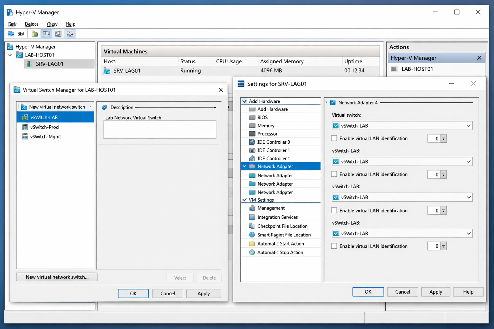
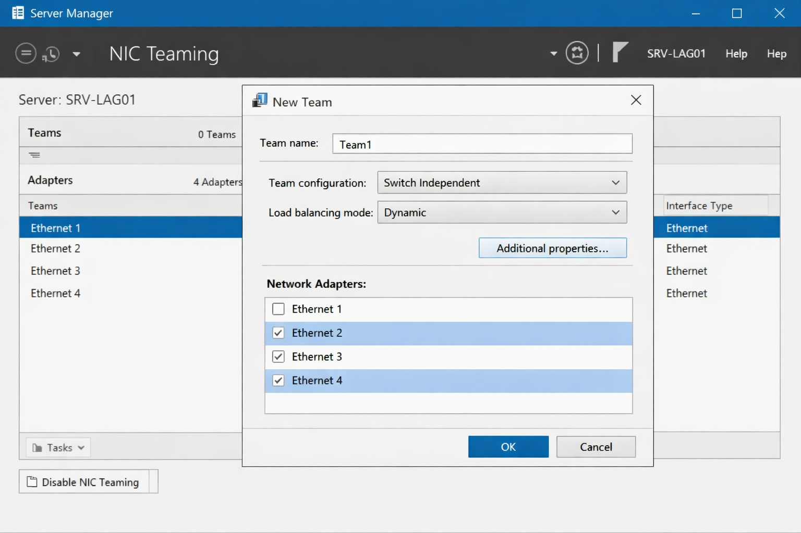
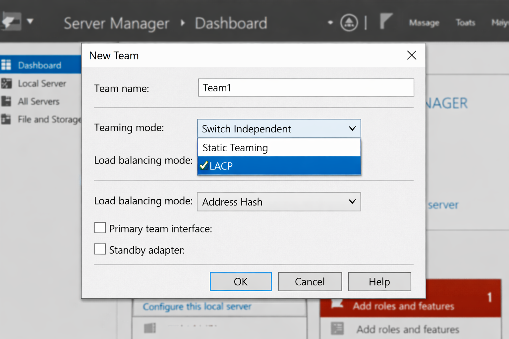
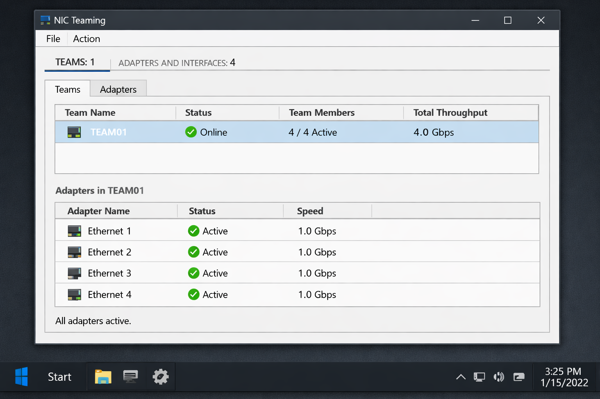
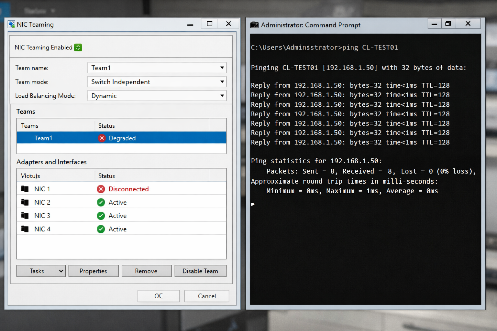

# LACP Configuration Guide for Windows Server

This guide provides a step-by-step walkthrough for configuring **Link Aggregation Control Protocol (LACP)** on a Windows Server, enhancing network bandwidth and providing redundancy. This setup is ideal for critical server roles and data center environments.

## Prerequisites

*   A Windows Server installation (e.g., Windows Server 2022).
*   A virtualized environment (e.g., Hyper-V) or a physical server with multiple network interface cards (NICs).
*   A network switch that supports LACP (IEEE 802.3ad/802.1ax).
*   Administrative privileges on the Windows Server.

## Step 1: Prepare Virtual Network Adapters (Hyper-V)

If you are using a virtual machine, ensure that your server has multiple virtual network adapters configured and connected to a virtual switch. For this lab, we assume four adapters are connected to a virtual switch named `vSwitch-LAB`.

1.  Open **Hyper-V Manager**.
2.  Select your virtual machine (e.g., `SRV-LAG01`).
3.  Go to **Settings** for the VM.
4.  Under **Add Hardware**, select **Network Adapter** and click **Add**.
5.  Repeat this process to add the desired number of network adapters (e.g., four).
6.  For each new adapter, ensure it is connected to the appropriate virtual switch (e.g., `vSwitch-LAB`).

## Step 2: Access NIC Teaming in Server Manager

NIC Teaming is configured through the Server Manager on Windows Server.

1.  Open **Server Manager**.
2.  In the Server Manager dashboard, navigate to **Local Server** in the left-hand pane.
3.  Locate the **NIC Teaming** section in the properties pane and click the **Disabled** or **Enabled** link next to it to open the NIC Teaming console.

## Step 3: Create a New NIC Team

Now, you will create the logical team using LACP.

1.  In the **NIC Teaming** console, under the **Teams** section, click **TASKS** and select **New Team**.
2.  In the **New Team** dialog box:
    *   **Team name**: Enter a descriptive name for your team (e.g., `TEAM01`).
    *   **Member adapters**: Select the network adapters you wish to include in the team (e.g., Ethernet 1, Ethernet 2, Ethernet 3, Ethernet 4).

    

3.  Under **Additional properties**:
    *   **Teaming mode**: Select **LACP**.
    *   **Load balancing mode**: Choose **Address Hash**. This mode distributes outbound traffic based on the source and destination IP addresses and TCP/UDP port numbers, ensuring that packets for a given conversation remain in order.

    

4.  Click **OK** to create the team.

## Step 4: Verify Team Status

After creating the team, it's crucial to verify its operational status.

1.  In the **NIC Teaming** console, observe the **Teams** section. Your newly created team (e.g., `TEAM01`) should show a status of **Online**.
2.  Under **Adapters and Interfaces**, all member adapters should display a status of **Active** with green checkmarks.
3.  Confirm the **Total Throughput** displayed for the team (e.g., 4.0 Gbps for four 1 Gbps adapters).

## Step 5: Test Failover

To demonstrate the redundancy provided by LACP, simulate a link failure and observe the network's resilience.

1.  From the **NIC Teaming** console, select one of the member adapters (e.g., Ethernet 1).
2.  Click **TASKS** and select **Disable** to simulate a link failure.
3.  Open a **Command Prompt** and run a continuous ping to another machine on the network (e.g., `ping CL-TEST01 -t`).
4.  Observe that the ping test continues without interruption or packet loss, even with one adapter disabled. The remaining active adapters will handle the traffic.

5.  Re-enable the disabled adapter to restore full bandwidth.

## Important Considerations

*   **Switch Configuration**: For LACP to function correctly, the connected physical or virtual switch ports must also be configured for LACP (often referred to as a Link Aggregation Group or EtherChannel).
*   **LACP Modes**: LACP operates in **Active** or **Passive** modes. At least one side (server or switch) must be in Active mode to initiate the LACP negotiation. A Passive + Passive configuration will not form a link.
*   **Matching Settings**: All links within the LACP team must have identical speed and duplex settings.
*   **Bandwidth vs. Redundancy**: While LACP increases available bandwidth, its primary benefit is redundancy. If one link fails, traffic seamlessly shifts to the remaining links, preventing network outages.

## Conclusion

By following these steps, you can successfully configure LACP on a Windows Server, creating a robust and high-performing network connection that offers both increased bandwidth and critical fault tolerance. This setup is fundamental for maintaining high availability in modern IT infrastructures.

---

## Author

**Manus AI**

---
